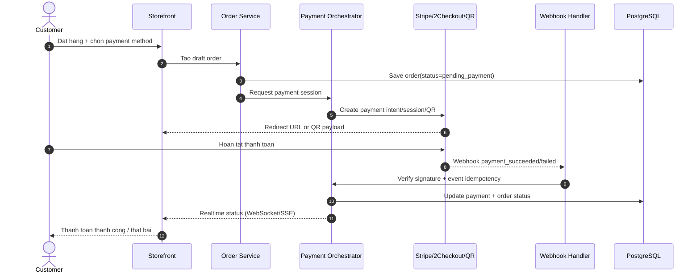

# KimGiangStore - So do web ban hang truc tuyen + Admin + Paygate

Tai lieu nay mo ta so do tong the cho 1 ecommerce store phong cach giong hinh mau: giao dien luxury co Homepage, The Treasury, Provenance, va thanh toan online.

## 1) So do kien truc tong the

```mermaid
flowchart TB
  %% ===== Client Layer =====
  subgraph C[Client Layer]
    SF[Storefront Web\nNext.js/Nuxt/React\nDesktop + Mobile]
    AP[Admin Panel Web\nRBAC Dashboard]
    CU[Customer]
    AD[Admin/Staff]
    CU --> SF
    AD --> AP
  end

  %% ===== Edge Layer =====
  subgraph E[Edge Layer]
    CDN[CDN + WAF\nCloudflare]
    LB[Load Balancer]
  end

  SF --> CDN
  AP --> CDN
  CDN --> LB

  %% ===== Application Layer =====
  subgraph B[Application Layer]
    API[API Gateway\nREST/GraphQL]

    subgraph SVC[Core Services]
      AUTH[Auth Service\nJWT + Refresh + MFA(Admin)]
      CATALOG[Catalog Service\nCollections, Products, Provenance]
      ORDER[Order Service\nCart, Checkout, Shipment]
      PAY[Payment Orchestrator\nStripe/2Checkout/QR]
      INV[Inventory Service\nStock + Reservation]
      CMS[CMS Service\nHero Banner, Story Blocks]
      CERT[Certificate Service\nCOA + Verification Code]
      NOTI[Notification Service\nEmail/SMS/Zalo]
      AUDIT[Audit Log Service\nAdmin actions + payment events]
    end

    API --> AUTH
    API --> CATALOG
    API --> ORDER
    API --> PAY
    API --> INV
    API --> CMS
    API --> CERT
    API --> NOTI
    API --> AUDIT
  end

  LB --> API

  %% ===== Data Layer =====
  subgraph D[Data Layer]
    PG[(PostgreSQL\nUsers, Products, Orders, Payments, Certificates)]
    REDIS[(Redis\nCache, Session, Rate-limit)]
    OBJ[(S3 Object Storage\nProduct images, COA files)]
    MQ[(Queue\nBullMQ/RabbitMQ)]
    SEARCH[(OpenSearch/Meili\nSearch + filter)]
  end

  AUTH --> PG
  CATALOG --> PG
  ORDER --> PG
  PAY --> PG
  INV --> PG
  CMS --> PG
  CERT --> PG
  AUDIT --> PG

  CATALOG --> REDIS
  ORDER --> REDIS
  AUTH --> REDIS

  CATALOG --> OBJ
  CERT --> OBJ

  CATALOG --> SEARCH

  ORDER --> MQ
  PAY --> MQ
  NOTI --> MQ

  %% ===== External Integrations =====
  subgraph X[External Integrations]
    STRIPE[Stripe API]
    TCO[2Checkout API\n(Verifone)]
    QR[QR Payment Provider\nVietQR/Napas/Bank]
    MAIL[Email Provider\nSendGrid/SES]
    SHIP[Shipping API\nGHN/GHTK/DHL]
  end

  PAY --> STRIPE
  PAY --> TCO
  PAY --> QR
  STRIPE -. webhook .-> PAY
  TCO -. webhook .-> PAY
  QR -. webhook/polling .-> PAY

  NOTI --> MAIL
  ORDER --> SHIP
```

## 2) Luong thanh toan (checkout)



## 3) Chuc nang theo khu vuc

- Storefront giong hinh mau:
  - Hero section (background noi that co vat + CTA "Explore the Treasury").
  - The Treasury grid (anh san pham, ten co vat, gia USD, nut View Details).
  - Provenance & Certificate section (nhan xac thuc + thong tin COA).
  - Footer payment logos va social links.
- Admin panel:
  - Product CRUD, collections, image gallery, rarity level.
  - Provenance va Certificate CRUD (ma xac thuc, file scan, lich su so huu).
  - Order/Payment dashboard (pending, paid, refunded, failed).
  - Inventory reservation + low stock alert.
  - CMS editor cho homepage section de thay noi dung khong can deploy.
  - User/Roles: super admin, curator, sales, support.

## 4) De xuat stack de bat dau nhanh

- Frontend: Next.js + Tailwind + Framer Motion.
- Admin: Next.js route rieng /admin hoac React Admin app tach rieng.
- Backend: NestJS/Express (TypeScript) + Prisma ORM.
- DB: PostgreSQL + Redis.
- Payments:
  - Stripe Checkout + Webhook.
  - 2Checkout Hosted Checkout + Webhook.
  - QR dynamic (VietQR provider) + callback/polling.
- Storage: S3-compatible (AWS S3/Cloudflare R2).
- Deploy: Vercel (frontend) + Render/Fly/EC2 (API) + managed Postgres.

## 5) Nguyen tac ky thuat quan trong

- Moi webhook deu phai verify signature va luu idempotency key.
- Khong trust trang thai thanh toan tu frontend; chi chap nhan khi server xac nhan webhook.
- Tach status order va status payment de xu ly refund/partial payment.
- Ghi audit log cho moi thao tac admin lien quan den gia, provenance, va certificates.
- Bat buoc RBAC + 2FA cho tai khoan admin.
